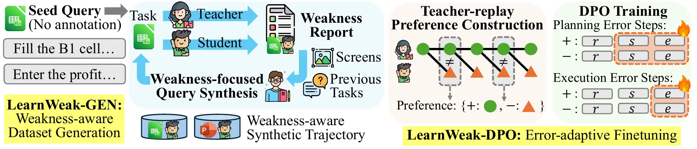

# Learn from Weaknesses: Automated Domain Specialization for Small Computer-Use Agents

<a href="https://learnweak.github.io/"></a>
<a href="https://arxiv.org/abs/2605.28775"></a>
<a href="https://www.python.org/downloads/"></a>

LearnWeak specializes small computer-use agents for target desktop domains by identifying student weaknesses, generating targeted practice tasks, and training from teacher/student trajectory differences.



## 🤗 Model Checkpoints

Base model: [`meituan/EvoCUA-8B-20260105`](https://huggingface.co/meituan/EvoCUA-8B-20260105)

| Target Domain | LearnWeak Adapter |
| --- | --- |
| GIMP | [🤗 `learnweak-evocua-8b-lora-r32-gimp`](https://huggingface.co/SujiKim/learnweak-evocua-8b-lora-r32-gimp) |
| LibreOffice Calc | [🤗 `learnweak-evocua-8b-lora-r32-libreoffice-calc`](https://huggingface.co/SujiKim/learnweak-evocua-8b-lora-r32-libreoffice-calc) |
| LibreOffice Impress | [🤗 `learnweak-evocua-8b-lora-r32-libreoffice-impress`](https://huggingface.co/SujiKim/learnweak-evocua-8b-lora-r32-libreoffice-impress) |
| LibreOffice Writer | [🤗 `learnweak-evocua-8b-lora-r32-libreoffice-writer`](https://huggingface.co/SujiKim/learnweak-evocua-8b-lora-r32-libreoffice-writer) |
| OS | [🤗 `learnweak-evocua-8b-lora-r32-os`](https://huggingface.co/SujiKim/learnweak-evocua-8b-lora-r32-os) |
| Thunderbird | [🤗 `learnweak-evocua-8b-lora-r32-thunderbird`](https://huggingface.co/SujiKim/learnweak-evocua-8b-lora-r32-thunderbird) |
| VLC | [🤗 `learnweak-evocua-8b-lora-r32-vlc`](https://huggingface.co/SujiKim/learnweak-evocua-8b-lora-r32-vlc) |
| VS Code | [🤗 `learnweak-evocua-8b-lora-r32-vscode`](https://huggingface.co/SujiKim/learnweak-evocua-8b-lora-r32-vscode) |

### Serve with vLLM

```bash
vllm serve meituan/EvoCUA-8B-20260105 \
  --enable-lora \
  --max-lora-rank 32 \
  --lora-modules learnweak-gimp=SujiKim/learnweak-evocua-8b-lora-r32-gimp
```

Use the LoRA module name, such as `learnweak-gimp`, when calling the served model.

## ⚙️ Setup

### 1. Clone and Install 

```bash
git clone https://github.com/sujiikim/LearnWeak
cd LearnWeak
conda create -n learnweak python=3.11 -y
conda activate learnweak
pip install -r requirements.txt
```

### 2. Prepare OSWorld

Install [OSWorld](https://github.com/xlang-ai/OSWorld) separately in the same `learnweak` environment, then register its checkout path. LearnWeak uses OSWorld only for virtual-machine and Docker desktop environments except its task configurations.

```bash
bash scripts/setup_osworld.sh --root /path/to/OSWorld
```

This writes `OSWORLD_ROOT` to `.env`. The shell scripts load `.env` automatically; run `source .env` only when calling Python modules directly.

### 3. Set API Keys

```bash
export OPENAI_API_KEY=...
```

## 🚀 LearnWeak Pipeline

The examples below run the GIMP domain. Use `--domain` or the domain-specific config paths to adapt the pipeline to other domains.

### 1. Generate Domain Data

Start student and teacher vLLM servers:

```bash
vllm serve meituan/EvoCUA-8B-20260105 --port 7001
vllm serve meituan/EvoCUA-32B-20260105 --port 7002
```

Run LearnWeak-GEN:

```bash
export STUDENT_MODEL=meituan/EvoCUA-8B-20260105
export STUDENT_VLLM_URL=http://localhost:7001
export TEACHER_MODEL=meituan/EvoCUA-32B-20260105
export TEACHER_VLLM_URL=http://localhost:7002

bash scripts/data_generation_evocua8b_gimp.sh --iterations 5
```

Resume a single stage with `--unit`:

```bash
bash scripts/data_generation_evocua8b_gimp.sh \
  --unit iter_student_inference \
  --step 3
```

### 2. Build DPO Data

Replay the student on teacher trajectories:

```bash
bash scripts/run_teacher_replay_gimp.sh
```

Convert trajectory pairs into LlamaFactory-format DPO data:

```bash
python -m learnweak_dpo.build_dpo_data --domain gimp
```

Outputs are written to:

- `learnweak_dpo/data/llamafactory/`
- `learnweak_dpo/data/dpo_images/`

### 3. Train LoRA

Train with the modified [sujiikim/LlamaFactory](https://github.com/sujiikim/LlamaFactory) fork:

```bash
git clone https://github.com/sujiikim/LlamaFactory
cd LlamaFactory
pip install -e .

llamafactory-cli train /path/to/LearnWeak/learnweak_dpo/configs/evocua_synthetic_dpo_gimp_dyn_e20.yaml
```

## 📝 Citation

```bibtex
@article{kim2026learnweak,
  title   = {Learn from Weaknesses: Automated Domain Specialization for Small Computer-Use Agents},
  author  = {Kim, Suji and Kim, Kangsa and Hwang, Sung Ju},
  journal = {arXiv preprint arXiv:2605.28775},
  year    = {2026}
}
```

## Acknowledgments

This project builds on [OSWorld](https://github.com/xlang-ai/OSWorld), [LlamaFactory](https://github.com/hiyouga/LlamaFactory), and [EvoCUA](https://github.com/meituan/EvoCUA).
